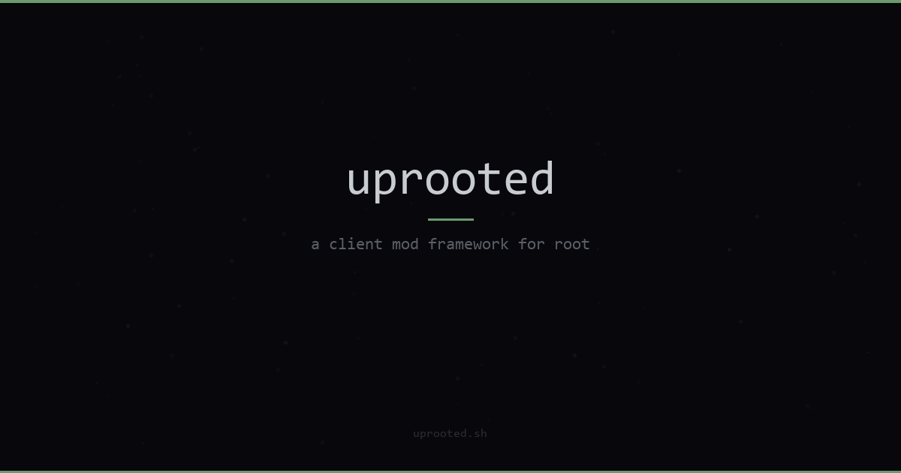

<p align="center">
  
</p>

<p align="center">
  a client mod framework for root communications
</p>

<p align="center">
  <a href="https://uprooted.sh"></a>
  
  
  
  
</p>

---

## features

- **custom themes** -- runtime switching, built-in presets, HSL color picker
- **plugin system** -- lifecycle loader, typed API
- **bridge api** -- ES6 proxy interception, 71 bridge methods
- **settings injection** -- native Avalonia UI in Root's settings sidebar
- **dual-layer architecture** -- C# .NET hook + TypeScript browser injection

## how it works

uprooted injects into both the native .NET layer and the embedded browser to provide full control over Root's UI and behavior.

```
root.exe (.NET 10 / avalonia)
  ├── [C# hook] CLR profiler injection
  │     ├── sidebar section in native settings
  │     ├── theme engine (avalonia resource overrides)
  │     └── settings pages (uprooted / plugins / themes)
  └── embedded chromium (DotNetBrowser)
        └── [TS injection] script tag into browser context
              ├── plugin loader + lifecycle runtime
              ├── bridge proxy (ES6 proxy over IPC interfaces)
              └── css theme engine (CSS variable overrides)
```

## stack

| layer | tech |
|-------|------|
| native hook | C# / .NET 10 / Avalonia 11 |
| browser injection | TypeScript / esbuild |
| installer | Tauri |
| landing site | Astro |
| monorepo | pnpm workspaces |

## documentation

| document | description |
|----------|-------------|
| [framework guide](docs/FRAMEWORK_GUIDE.md) | complete architecture and implementation reference |
| [how it works](docs/HOW_IT_WORKS.md) | high-level overview of the injection model |
| [getting started](docs/plugins/GETTING_STARTED.md) | plugin development quickstart |
| [api reference](docs/plugins/API_REFERENCE.md) | full plugin API surface |
| [bridge reference](docs/plugins/BRIDGE_REFERENCE.md) | bridge method catalog and usage |
| [contributing](CONTRIBUTING.md) | contribution guidelines |

## policy

**uprooted is not affiliated with root communications.** this is an independent community project.

all modifications are cosmetic-only and do not interact with root's backend services. users should review root's terms of service before use. we will not distribute injection code until we have explicit approval from root's developers.

> uprooted is a working beta. the framework is complete and functional. distribution is on hold pending developer approval.

## links

- [uprooted.sh](https://uprooted.sh) -- landing page
- [root support server](https://rootapp.com/server/root) -- official root server
- admin@watchthelight.org -- email
- @watchthelight -- discord

## license

[gpl-3.0](LICENSE)
